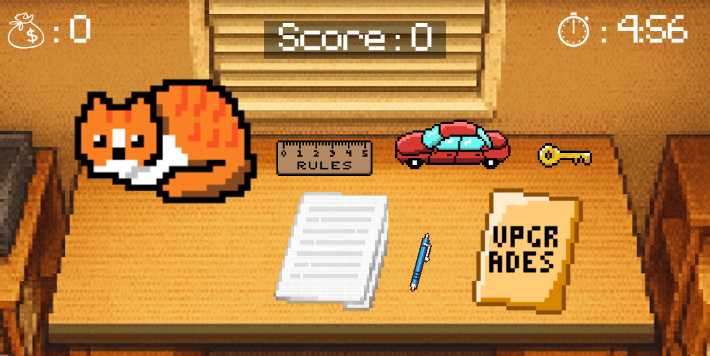
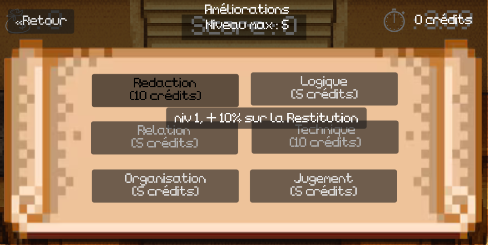
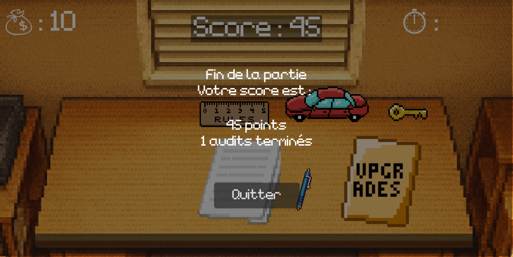

# AuditClicker

AuditClicker est un jeu de type clicker éducatif dans lequel le joueur incarne un auditeur qui réalise des audits en entreprise depuis son bureau.

L'objectif est de faire découvrir au joueur les concepts d'audit et de gestion administrative afin de lui faire comprendre l’impact de ses choix lorsque des problèmes se posent dans une entreprise.

Sur le plan pédagogique, notre but est de transmettre au joueur de nouvelles connaissances, afin de lui faire découvrir ou clarifier le concept d’audit.

---

## Installation et utilisation

### Dans Godot

1. [Télécharger](https://godotengine.org/download/) et installer Godot Engine

2. Télécharger le contenu de ce repo, ou le cloner grâce à la commande `git clone https://git.unistra.fr/seau6peau1com/saucissemoutarde.git`

3. Démarrer Godot et ouvrir le projet (en sélectionnant le dossier `auditclicker` du dossier téléchargé précédemment)

4. Une fois le projet chargé, cliquer sur l'icône ▶ en haut à droite de l'interface de Godot

5. Le jeu se lance dans une nouvelle fenêtre.

### Via un exécutable/Application

1. Naviguer jusqu'au dossier `auditclicker/export` via l'interface GitLab ou cliquer sur les liens à l'étape 3 

2. Naviguer dans le dossier correspondant à votre système d'exploitation (Windows/Linux/Android)

3. Selon le choix effectué à l'étape 3, cliquer sur :
    - [AuditClicker_Windows.zip](auditclicker/export/Windows/AuditClicker_Windows.zip) (Windows) 
    - [AuditClicker_Linux.zip](auditclicker/export/Linux/AuditClicker_Linux.zip) (Linux)
    - [AuditClicker_Android.zip](auditclicker/export/Android/AuditClicker_Android.zip) (Android)

4. Extraire l'archive téléchargée à l'étape 3

5. Lancer/Cliquer sur (selon l'archive téléchargée) : 
    - AuditClicker.exe    (Windows)
    - AuditClicker.x86_64 (Linux)
    - AuditClicker.apk    (Android)

6. Le jeu se lance dans une nouvelle fenêtre.

---

## Présentation

### Menu de démarrage

Au démarrage du jeu, un écran d'accueil simple est proposé au joueur. Il affiche notamment le nom du jeu et un bouton pour démarrer.  

Ensuite, le concept ainsi que le fonctionnement est expliqué en détail sur plusieurs écrans, puis le jeu commence.  

### Gameplay

Le gameplay se fait sur un écran principal, présenté ci-dessous. Il représente l'espace de travail de l'auditeur incarné par le joueur.  
Plusieurs éléments cliquables sur l'interface représentent les étapes de réalisation d'un audit. C'est au joueur de trouver la bonne action à effectuer (avec l'aide de certains indices visuels).  
  
Pour chaque étape ou audit complet achevé, le joueur est récompensé grâce à des crédits (en plus du score qui augmente).  
Il peut les dépenser dans des améliorations de ses compétences, provoquant une diminution de la durée nécessaire à la réalisation des phases.  

### Fin du jeu

Le jeu se termine après 5 minutes de gameplay et affiche le score final du joueur (qui est déterminé à partir du nombre d'audits réalisés).  

---

## Contributions

[DE AZEVEDO Mathis](https://github.com/KitsuneRandom)  
[WOLFF--WALK Jules](https://github.com/julesWW/)

---

## Licence

[MIT](https://choosealicense.com/licenses/mit/)  
[Conditions d'utilisation](licenses/Conditions_d_utilisation.txt)

---

Des informations plus détaillées sont disponibles dans le [Wiki du projet](Description.md).
